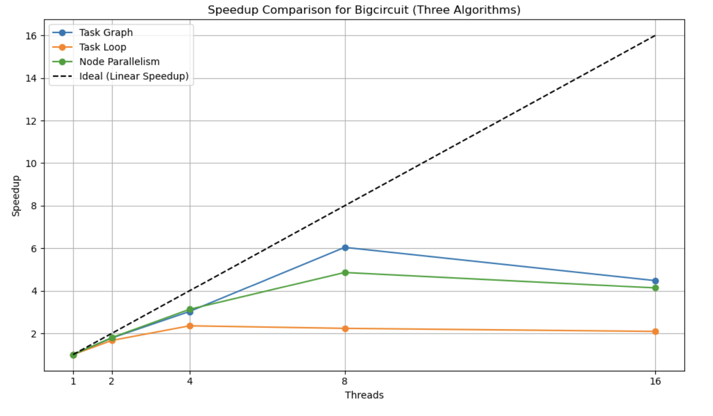

# parallel-sta

# Parallel Static Timing Analysis - Final Project for 15618 Spring 2025

**URL:** [https://mjain00.github.io/parallel-sta/](https://mjain00.github.io/parallel-sta/)

## Summary
Our goal for this project was to **parallelize a Static TIming Analysis** tool which checks if a circuit has any setup or hold time violations. We have parallelized the algorithm on **multi-core GHC machines using OpenMP**. In this report, we will show multiple algorithms that we implemented from a research paper. The first algorithm we explored is using task loop parallelism by pipelining our algorithm. We also have an implementation of node parallelism which is a middle ground between the task loop and task graph implementations. The next algorithm from the paper explores parallelism by creating a task graph for the circuit. We demonstrate that our results align with those from the paper, in that we see greater speedup from the task graph implementation.

## Proposal
Here is our project [proposal](proposal.pdf).

## Milestone Report
Here is our [milestone report](milestone.pdf).

## Final Report
Here is our [final report](final.pdf).

## Background:  
STA is a verification tool that allows designers to verify that their signals propagate through the circuit fast enough to meet setup constraints. It ensures that the signals within the circuit comply with the clock's frequency, and that the clock is able to capture the signals accurately. In our design, we used a “pessimistic approach” where we assumed the worst case to verify correctness of the design. The main goal of a STA is to analyze the propagation delays - arrival time and required time. The forward pass is the arrival time which is when the signal reaches a certain point in the circuit. The backward pass is the required time that must be adhered to avoid timing failures.  The *forward pass consists of three stages* that must occur sequentially for a component in a circuit: RC, slew, and arrival time calculation. The arrival time depends on the RC and slew delay which are calculated from a component's neighbors. The slew depends on the RC values, thus creating a chain of dependent functions. The *backward pass is calculated from the circuit's outputs and goes inwards*, keeping into account the time needed for the clock to accurately capture the signal. We use the equation required time = clock period - setup time and propagate it backwards to see if the signal reaches before the clock. Since we’re using a pessimistic approach, we take the highest delay for each calculation. We calculate the slack = required time - arrival time with a negative slack indicating timing violations. Usually, STA is a very sequential algorithm due to its dependence on sequential functions and paths. However, if the mode of parallelism is captured carefully, we can see significant parallelism.  

## Platform Choice

The platform chosen for this project is a **multi-core CPU environment** using **OpenMP**. This setup uses a **shared address space**, which is advantageous due to the expected high level of communication and data sharing between tasks. While careful synchronization is necessary, this approach is more efficient than using a distributed memory model in this scenario.  

**OpenMP** will allow us to dynamically allocate tasks to different threads and define dependencies between the data. This provides a flexible and efficient way to handle the parallelization of the STA algorithm.

## Inputs & Outputs:
Inputs:  All the implementations we have explored have the same inputs and outputs, while they may transform the data based on the implementation.
 - ASIC object which describes the inputs and outputs of the circuit, and all the delays
 - Adjacency matrix/DAG which represents the connections between the circuit elements.

Outputs: The timing for every node. This includes the arrival time, required arrival time, slack, and thus prints if there is a timing violation for each node in the circuit. 

## Challenges:
### Sequential Dependencies:  
The above algorithm is difficult to parallelize due to **sequential dependencies**. In static timing analysis, the **arrival time** of a node depends on all its predecessors, meaning **slack values** cannot be determined until all arrival times are calculated. Parallelizing this requires **synchronization** between tasks. Additionally, the calculation of the RC and Slew values for a given nodes also have to be performed sequentially. 

### Workload Imbalance:  
Multiple parallel tasks read/write shared data (same paths), which can lead to **cache contention** and **race conditions**. Additionally, some paths may have significantly more gates, causing **uneven workload distribution** across parallel tasks.

### Memory and Synchronization:  
To efficiently parallelize the algorithm, we need to store task graphs in memory while maintaining **temporal** and **spatial locality**. In the sequential version of the algorithm, we traverse the graph using **Depth First Search (DFS)**. For the parallel case, we can create a task for each branch and continue executing DFS on them.

The algorithm’s **high communication-to-computation ratio** is a challenge, as much of the execution depends on task synchronization and sharing timing values across paths.  

Given that we will be using a **shared memory system**, we need to ensure that updates to shared data are **thread-safe** and free of **race conditions**. Additionally, mapping portions of the graph to specific threads or cores is a non-trivial task. We must ensure that tasks are divided so that each thread works only on its own section of the graph and does not interfere with others until absolutely necessary.

## Resources:  

- **GHC Machines** for running the code.  

- **Paper 1 (Primary Source):**  
  Tsung-Wei Huang, Boyang Zhang, Dian-Lun Lin, and Cheng-Hsiang Chiu.  
  *Parallel and Heterogeneous Timing Analysis: Partition, Algorithm, and System.*  
  In Proceedings of the 2024 International Symposium on Physical Design (ISPD '24).  
  Association for Computing Machinery, New York, NY, USA, 51–59.  
  [DOI: 10.1145/3626184.3635278](https://doi.org/10.1145/3626184.3635278)

## Goals & Deliverables

### Plan to Achieve:  
In this project, our team plans to significantly speed up the **STA algorithm** by finding avenues of parallelism. Similar to the assignments in class, there are multiple ways to parallelize this algorithm, and we want to experiment with these techniques. We aim to build on each iteration of our parallel algorithm to explore the tradeoffs between performance and accuracy.  

To begin, we should have a robust **sequential code** working that traverses paths and finds any timing violations. Then, our team plans to work on at least two separate algorithms:  

1. **OpenMP**  
   We want to create a graph that can parallelize independent paths (paths with no dependencies). This involves creating tasks using **BFS**, going down the branches to calculate time for previous layers, using a synchronization barrier, and parallelizing the next components.  

2. **Task Graph Parallelism**  
   Building on OpenMP, we want to create a task graph where the **nodes** represent tasks and the **edges** represent dependencies. This approach eliminates the need for synchronization barriers by using a task queue where processors will steal tasks that are ready. While we can’t give a specific speedup, we expect better performance by avoiding the iterative wait for previous tasks to complete.

### Hope to Achieve:  
In addition to the above methods, we plan to explore the following:  

- **MPI**: Use **MPI** to communicate components or paths that are shared. This will involve heavy synchronization and is a tradeoff we need to explore.  
- **CUDA Kernel**: Investigate the creation of a **CUDA kernel** that performs **STA** and explore avenues for speedup to determine if more processors result in a greater speedup.  
- **Clusters of Tasks Parallelism**: Partition the circuit to create clusters of similar, independent tasks. The research paper suggests that small, insignificant paths incur overhead, so it’s important to cluster tasks efficiently for computational efficiency.

### What We Hope to Learn:  
From this project, we want to understand how the **STA algorithm’s performance** can be improved using different parallelization techniques. Our team will explore the potential benefits of parallelism for large circuits and investigate which methods provide the best speedup.  

The project will compare our **OpenMP parallel implementation**, **Graph Parallelism**, and other algorithms, investigating the tradeoffs between performance and the overhead of each technique. Additionally, we aim to determine the scalability of these techniques. Some key questions we want answered include:

- Do some circuits have better performance with the sequential algorithm due to overhead?
- Is parallelization more efficient for larger circuits?
- How does slack impact performance? How does problem size affect synchronization and overhead?
- How does parallelism impact correctness in STA? What are the bottlenecks?
- How can we create a task graph that considers data dependencies?

Our performance goals focus on **speedup**, **scalability**, **efficiency**, and **correctness**, and we will analyze the tradeoffs for each strategy.

## Approach

### Node Parallelism

Forward pass:
Just as earlier, we would add all the nodes with an inDegree of 0 to the “queue” which is actually a vector. We used a “parallel for” pragma to divide up the work among the threads. Since the queue at this point only contains the independent, these tasks can be run concurrently. Here, the function-level dependencies are not violated because the entire iteration is done sequentially. One major consideration was that multiple threads should not be able to update the inDegree of their common neighbor at the same time, thus this update was locked in a critical section. Once a node reached inDegree 0, we would update the global queue before the next iteration to find all the nodes which can be run independently. 

Backward pass:
Similar to the forward pass, we would start from the end of the “sorted” vector and parallelize the loop that runs through the independent nodes level by level, and propagate backwards.

In both passes, we had to ensure that the updates to the global bookkeeping data structures like arrival_time, etc. are enclosed in a critical section.

### Task Loop Parallelism

This implementation required us to switch from a “sorted” vector to a level list. The creation of the level list does not compute the arrival time for any of the nodes, instead it just ensures that we have a list of all the nodes at each level of the circuit. As we showed earlier, all the nodes at a particular level can be computed concurrently, so the level list helps us with parallelizing the forward and backward passes of STA. 

For the circuit shown above in our report, we get the following level list where each number in the list represents a circuit element: 

| Level   | Values   |
|---------|----------|
| Level 0 | 2 3      |
| Level 1 | 6 7      |
| Level 2 | 8        |
| Level 3 | 4        |

In this implementation, we have one master thread that spawns tasks for each level of the circuit. The key thing to note here is the level for which the tasks are being created - the tasks operations with dependencies are launched in later iterations of the loop, thus ensuring that the dependencies are not violated. Also, another thing to note is that for our implementation, we only used the RC, Slew, and arrival time computations, and did not include the jump point, and CPPR functions due to our dataset having limited complexity. We also have barriers implemented using “taskwait” between iterations of the loop. This ensures that all the tasks launched in a certain iteration complete before new tasks are launched. Additionally, the barriers can increase idle time as threads wait on the slowest thread in a level to finish work. Since some nodes can take longer, we don’t have good load balancing.

For instance: When we start at level 0, we only create a task for RC for the nodes in level 0. In the next iteration, we create RC tasks for all the nodes in level 1 and also create Slew tasks for level 0. When we are at level 2, we launch RC tasks for level 2 nodes, Slew tasks for level 1 nodes, and ArrivalTime tasks for nodes in level 0, and so on.

### Task Graph Parallelism

As seen in our previous iterations, we ran into the issue of synchronization barriers. The synchronization barrier on each level caused overhead as all the threads had to wait on each other to finish. This caused significant delays and idle times as workload wasn’t balanced and certain nodes took faster. Thus, our next stage was to eliminate barriers by employing task graphs.

In this algorithm, we employed more parallelism by creating a taskgraph to allow more tasks to run in parallel. The task graph replaces the barriers between levels by using “edges” to represent dependencies. 

This mode of parallelism allows for threads to continuously have “work” and creates a larger task pool. In our previous algorithm, we had to finish tasks spawned in level 1 before moving on to level 2. We had a set of barriers between components which caused synchronization stalls for threads. Now, we no longer synchronize by level, but by tasks and their edges. If a component is on a different level, it can still be processed with other components as long as its dependencies are met. Additionally, we saw better performance with a static assignment because our queue had enough tasks to statically assign without incurring the overhead of dynamic scheduling.  Since there are more tasks, we have better load balancing because the threads don’t stall and are assignment more concurrent tasks. 

In order to support a task graph, we changed the sequential algorithm to support a processing unit that takes a task and processes it accordingly, assuming that its dependencies have been met. We also run both the forward and backward passes concurrently.

This algorithm focuses on the fact that once a path has been fully traversed, we can start the backward propagation. 

In the graph, we created the task “be_required” which signifies that we can calculate the backward pass for the node. In order to make this change, we added a backward processing unit in the sequential code.

The mode of parallelism changed from having a barrier between forward and backward to having edges that represent dependency. When we hit the output of a path, we can go backwards and calculate the required time. This eliminates the need for a barrier between the white (forward) and black (backward) nodes in the figure above, as we can do both computations in parallel.

## Overall Results

This is a speedup graph which compares the performance of the forward propagation of the three major algorithms we have implemented using the bigcircuit. The speedup for each of the implementations was calculated by setting the number of threads to 1, due to the difference in data layout. The dashed line shows the linear speedup, which is ideally what we want.

We can see that out of all the algorithms, the task graph implementation performs the best, while the task loop parallelism has the lowest speedup. The fact that none of the three implementations reach linear speedup shows that there are a lot of dependencies, which make parallelizing this algorithm a difficult task.

The benefit of the task graph is that we are not using a barrier at each level of the circuit. This allows the nodes along a path to continue processing if their inputs have already been processed, thus lowering the synchronization time and idle time for threads. Both other implementations use barriers between two consecutive levels of the circuit. 

The node parallelism implementation ends up performing better than the task loop implementation. Even though there is a barrier between each level, the node parallelism uses static scheduling when it assigns threads to nodes within a queue to process. While static scheduling may sometimes result in poor load balancing, here we are assured that each of the nodes are not waiting on any other inputs and can start being processed, which allows us to benefit from the lower overhead of static scheduling.

The task loop implementation incurs a lot of overhead due to creating 3 tasks for each node, dynamically assigning tasks to threads, scheduling decisions, and barriers at every level.

